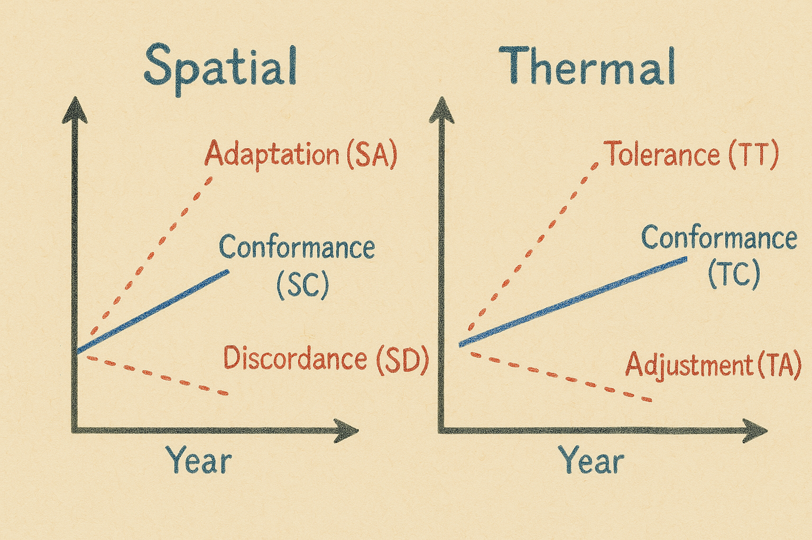

# SppTrend: Analyzing Linear Trends in Species Occurrence Data

[](https://cran.r-project.org/package=SppTrend)

**SppTrend** is an R package that provides a methodology to analyze trends in species occurrence data over time, with a particular focus on the influence of environmental factors such as temperature. This package facilitates the derivation of explanatory hypotheses about the effects of distribution changes in species assemblages, based on historical presence data that includes temporal and geographic information.

## Installation

You can install the released version of SppTrend from CRAN:

```{r}
install.packages("SppTrend")
```
or
```{r}
install.packages("devtools")
library(devtools)
devtools::install_github("MarioMingarro/SppTrend")
```

## Overview of Key Features
The `SppTrend` package provides the following key functionalities:

This package provides a methodology to derive explanatory hypotheses about the effects of distribution changes in species assemblages. It is based on the use of historical species presence datasets that include, at a minimum:

Sampling date (year and preferably month and year)
Geographic location (latitude and longitude)
It is assumed that the data represent species occurrences along a temporal or predictive sequence of change in their responses.

In this package, there are two important aspects:

  - **Predictors**: Date

  - **Responses**: Latitude, longitude, elevation, maximum temperature, minimum temperature, and mean temperature.

## Methodological Proposal

### Phase 1: Temperature Data Generation

Before analyzing species assemblages, the package provides tools to complete the temperature data of the database. The `SppTrend` package provides the `get_era5_tme()` function to obtain the average temperature of the presences.

Notes: ERA5 data starts in 1940.

```{r}
Data_with_Tme <- get_era5_tme(Data, nc_file, month_col = "month")
```

### Phase 2: Estimation of the Overall Trend of Responses

The package calculates the Overall Trend (OT), which represents the average trend of the different responses for all species occurrences in the dataset. This serves as a neutral reference point to compare with the individual responses of different species.

However, biodiversity databases often contain spatial and temporal biases (e.g., more sites sampled at high elevations in recent years, or low-altitude areas overlooked due to land-use changes). These biases can influence the OT, making its interpretation complex. Therefore, the OT should be considered a general pattern rather than a definitive measure of species adaptation.

The `general_trend()` function:
```{r}
general_trend_result <- general_trend(Data, responses, predictor)
```

### Phase 3: Estimation of Individual Trends of Responses

The package calculates the individual trend per species (SppT, SpeciesTrend), which represents the individual trend of the different responses for each species in the dataset. This serves as a way to compare individual species responses with the overall trends.

The `spp_trend()` function:
```{r}
general_trend_result <- spp_trend(Data, spp, predictor, responses, n_min = 50)
```
### Phase 4: Analysis of Specific Species Responses

The package provides methods to compare the presence patterns of individual species with the overall trend.

The `spp_strategy()` function:
```{r}
spp_strategy_results <- spp_strategy(spp_trends_results, bonferroni = 0.05)
```
### Different strategies

Three possible spatial responses and three thermal responses can be identified:



**Spatial Responses**

  - *Spatial Adaptation (SA)*: The species' presence shows a positive temporal trend, significantly different from the OT.

  - *Spatial Discordance (SD)*: The species' presence shows a negative temporal trend, significantly different from the OT.

  - *Spatial Conformity (SC)*: The species' presence follows a temporal trend similar to the OT.

**Thermal Responses**

  - *Thermal Tolerance (TT)*: The species shows a positive response to temperature over time, significantly different from the OT.

  - *Thermal Conformity (TC)*: The species follows a thermal trend similar to the OT. 

  - *Thermal Adjustment (TA)*: The species shows a negative response to temperature over time, significantly different from the OT. 

### Applications and Limitations
This package is useful for researchers studying the effects of climate change on biodiversity. However, caution should be exercised when interpreting the results due to potential biases in species presence data. The OT serves as a reference but not as an absolute indicator of species responses to warming.

For more detailed information and examples, please refer to the package documentation within R:

```{r}
help(package = SppTrend)
# Or for a specific function:
help(general_trend)
```
## References
This package is based on the methodology described in:

Jorge M. Lobo, Mario Mingarro, Martin Godefroid, Emilio García-Roselló 2023. Taking advantage of opportunistically collected historical occurrence data to detect responses to climate change: The case of temperature and Iberian dung beetles. Ecology and evolution, 13(12) e10674. https://doi.org/10.1002/ece3.10674 

## Contact
For any questions or issues, please feel free to contact:

Mario Mingarro Lopez
mario_mingarro@mncn.csic.es
