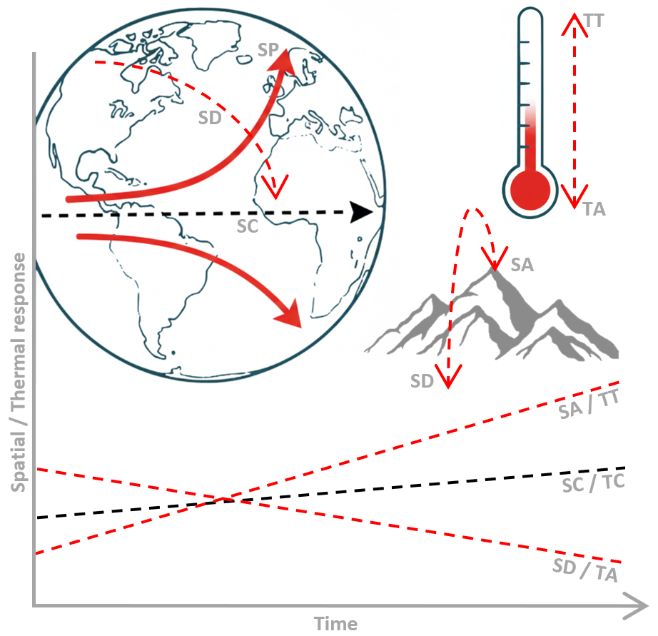
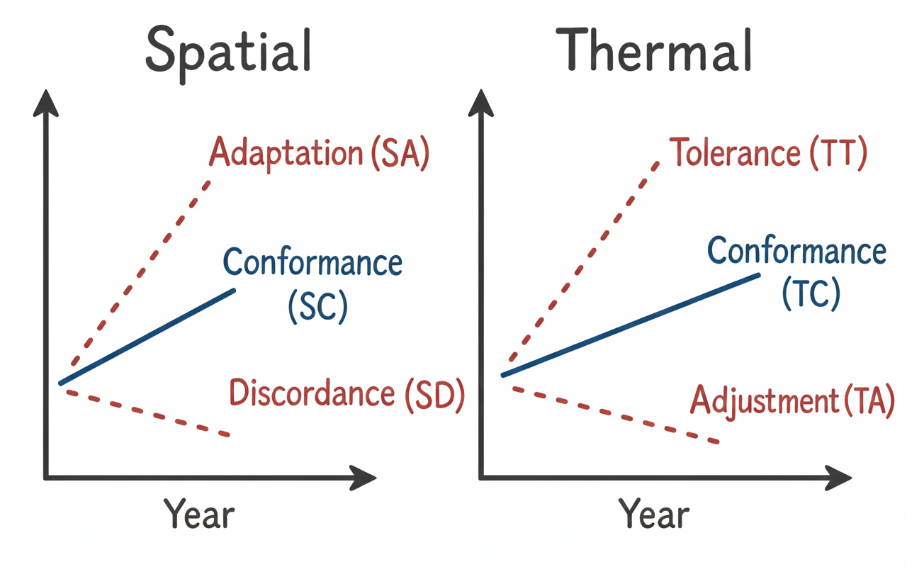

# SppTrend: Analyzing Linear Trends in Species Occurrence Data

[](https://cran.r-project.org/package=SppTrend)

<div align="center">
  
</div>

The R package `SppTrend` provides a methodology to analyze how species occurrence changes over time, particularly in relation to environmental factors like temperature. 
It helps researchers develop explanatory hypotheses about the impact of environmental shifts on species assemblages by analyzing historical presence data that includes temporal and geographic information.

## Installation

You can install the released version of SppTrend from CRAN:

```{r}
install.packages("SppTrend")
```

Alternatively, you can install the development version from GitHub:

```{r}
install.packages("devtools")
library(devtools)
devtools::install_github("MarioMingarro/SppTrend")
```

## Overview of Key Features

`SppTrend` helps understand species responses to environmental change by analyzing historical occurrence data that includes:

  - **Predictors** - Sampling date (year, preferably month and year)

  - **Responses** - Geographic location (latitude and longitude) and environmental factors (elevation and temperature).

The methodology assumes that the observed species occurrences reflect a temporal sequence of changes in response to these factors.

## Workflow

`SppTrend` provides a structured workflow for analyzing these trends:

1.  **Environmental Data Integration (Optional)**:  Enhance your occurrence records with environmental context using functions like `get_era5_tme()` for temperature data or `extract_elevation()` for elevation.
2.  **Overall Trend Estimation**: Calculate the average temporal trend of selected response variables across all species using `overall_trend()`. This provides a general baseline to compare with individual specie trend.
3.  **Individual Trend Analysis**: Determine the specific temporal trends for each species and response variable using `spp_trend()`. This allows comparison of individual species' responses to the overall trend.
4.  **Ecological Strategy Classification**: Categorize species into distinct ecological strategies based on the significance and direction of their individual trends relative to the overall trend using `spp_strategy()`.

### Data Requirements

To utilize the package effectively, your dataset must, at a minimum, include the following information for each occurrence:

* Species identification (e.g., 'species').
* Geographic coordinates: Latitude (e.g., 'lat') and Longitude (e.g., 'lon'). The package assumes the use of the **WGS84 (World Geodetic System 1984)** coordinate reference system for global applicability.
* Temporal information: Year (e.g., 'year') is required. Including Month (e.g., 'month') is highly recommended for more detailed analysis.


**Important** 

Ensure that the column names in your input dataset match the default names expected by the `SppTrend` functions. These default names are:

- **Species Name**: 'species'
- **Year**: `year`
- **Month**: `month`
- **Longitude**: `lon`
- **Latitude**: `lat`
- **Environmental Response Variables** (if applicable): 
  - **Elevation**: `ele`
  - **Temperature**: `tme`
  - **Maximum temperature**: `tmx`
  - **Minimum temperature**: `tmn`

The following is an example illustrating the structure of a data frame containing 500 randomly generated presence records for 10 distinct species:

```r
data <- data.frame(
  species = sample(paste0("spp_", 1:10), 500, replace = TRUE),
  year = sample(1950:2020, 500, replace = TRUE),
  month = sample(1:12, 500, replace = TRUE),
  lon = runif(500, -10, 20),
  lat = runif(500, 30, 70)
)

data$year_month  = data$year + data$month * 0.075
```
### Detailed Steps

### Phase 1: Environmental Data Generation

The `SppTrend` package offers functions to enhance your species occurrence data with relevant environmental information. Currently, it supports the integration of temperature and elevation data.

#### ERA5 Temperature Data

ERA5 is the fifth generation European Centre for Medium-Range Weather Forecasts (ECMWF) reanalysis dataset for the global climate and weather. It provides comprehensive atmospheric, land, and ocean climate data from 1940 to the present, with high spatial and temporal resolution. This makes it a valuable resource for studying the impact of climate on species distributions.
You can explore the ERA5 daily statistics dataset on the Copernicus Climate Change Service (C3S) Climate Data Store (CDS) at: [ERA5 Daily Statistics Overview](https://cds.climate.copernicus.eu/datasets/reanalysis-era5-single-levels-monthly-means). For more detailed information about the ERA5 dataset, please visit the [ECMWF website](https://confluence.ecmwf.int/display/CKB/The+family+of+ERA5+datasets).

The `SppTrend` package provides the following function to incorporate ERA5 temperature data:

`extract_era5_data()`: Allows users to obtain average temperature data (mean temperature of the environment) for species occurrences using ERA5 reanalysis data. 

*Notes: ERA5 data is available from 1950 onwards. The data must be in `.netcdf` format.*

```{r}
nc_file <- "path/to/your/era5_data.nc"
data <- extract_era5_data(data, nc_file, month_col = "month")
print(data$tme)
```
#### Digital Elevation Model (DEM) Data

`extract_elevation()`: This function can be used to retrieve Digital Elevation Model (DEM) data for the species occurrences, providing information about the elevation at which the species were recorded.
For obtaining elevation data for species occurrences, this example utilizes the WorldClim dataset ([WorldClim](https://www.worldclim.org/data/worldclim21.html)). However, users are encouraged to consider other Digital Elevation Models (DEMs) based on the specific resolution requirements of their analysis. For instance, the [EU-DEM dataset](https://dataspace.copernicus.eu/explore-data/data-collections/copernicus-contributing-missions/collections-description/COP-DEM) provides high-resolution elevation data for Europe.

Furthermore, it is highly recommended to utilize any existing elevation data already present within the user's occurrence dataset. This allows for a direct comparison and validation of the retrieved elevation values, potentially improving the accuracy and reliability of the analysis.
*Notes: DEM data must be in `.tif` format.*
```{r}
dem_file <- "path/to/your/dem.tif"
data <- extract_elevation(data, dem_file)
print(data$ele)
```
### Phase 2: Estimation of the Overall Trend of Responses

The `overall_trend()` function calculates the overall temporal trend  for specified response variables across the entire dataset. 
This trend serves as a neutral reference to evaluate individual species' responses. It's important to consider potential biases in the data when interpreting the OT.

```{r}
predictor <- "year"
responses <- c("lat", "lon", "ele", "tme")
overall_trend_result <- overall_trend(data, responses, predictor)
print(overall_trend_result)
```

### Phase 3: Estimation of Individual Trends of Responses

The `spp_trend()` function calculates the individual temporal trend for each species and response variable, comparing it to the overall temporal trend observed in the data. It also handles longitude transformations and considers hemisphere-specific trends.

```{r}
predictor <- "year"
responses <- c("lat", "lon", "ele", "tme")
spp <- unique(data$species)
spp_trend_result <- spp_trend(data, spp, predictor, responses, n_min = 50)
print(spp_trend_result)
```

### Phase 4: Analysis of Specific Species Responses

The `spp_strategy()` function analyzes the results from `spp_trend()` to classify species into different ecological strategies based on the significance and direction of their trends relative to the overall trend. 
This function incorporates logic for poleward shifts in latitude based on hemisphere and can also classify trends in elevation.

```{r}
spp_strategy_result <- spp_strategy(spp_trend_result, sig_level = 0.05, responses = c("lat", "lon", "ele", "tme"))
print(spp_strategy_results)
```

### Ecological strategies

The `SppTrend` package identifies several spatial and thermal response strategies:

<div align="center">
  
</div>

**Spatial Responses**

  - **Spatial Adaptation (SA)**: A positive trend in presence, which in the context of climate change in the Northern Hemisphere, might often be associated with a Spatial Poleward (SP) shift as the species expands into newly suitable, higher-latitude areas. 
  In the Southern Hemisphere, this adaptation might involve a Spatial Equatorward (SE) shift (towards higher latitude values).
 
  - **Spatial Discordance (SD)**: A negative trend in presence, which in the context of climate change in the Northern Hemisphere, might often be associated with a Spatial Equatorward (SE) shift as the species retreats from less suitable, lower-latitude areas. 
  In the Southern Hemisphere, this discordance might involve a Spatial Poleward (SP) shift (towards lower latitude values).

  - **Spatial Conformity (SC)**: The species' presence trend follows the overall trend, suggesting less directional pressure in terms of range shift at this level of analysis.
  
  

**Thermal Responses**

  - **Thermal Tolerance (TT)**: The species shows a positive response to temperature over time, significantly different from the OT.

  - **Thermal Conformity (TC)**: The species follows a thermal trend similar to the OT. 

  - **Thermal Adjustment (TA)**: The species shows a negative response to temperature over time, significantly different from the OT. 

In essence, while SA and SD describe the 'what' (change in presence) and SP/SE a potential 'how' (direction of geographic shift along the latitudinal gradient), 
these spatial responses should be considered together with the thermal responses (TT, TA) to understand if both point towards a consistent overall direction of a species' 
response to environmental change.

### Applications and Limitations
`SppTrend` offers a valuable methodology for researchers investigating how environmental change impacts biodiversity by analyzing trends in species occurrence data.
However, it's crucial to interpret results cautiously, as species occurrence data can be subject to various biases (e.g., sampling effort, observer expertise). 
While the overall trend provides a useful community-level reference, remember that it represents an average across all species and might mask diverse individual species responses to environmental drivers like warming. 
Therefore, focusing on individual species trends and their classification into ecological strategies provides a more nuanced understanding of biodiversity responses.

For more detailed information and examples, please refer to the package documentation within R:

```{r}
help(package = SppTrend)
# Or for a specific function:
help(spp_trend)
```
## References
This package is based on the methodology described in:

Jorge M. Lobo, Mario Mingarro, Martin Godefroid, Emilio García-Roselló 2023. Taking advantage of opportunistically collected historical occurrence data to detect responses to climate change: The case of temperature and Iberian dung beetles. *Ecology and evolution*, 13(12) e10674. https://doi.org/10.1002/ece3.10674 

## Contact
For any questions or issues, please feel free to contact:

Mario Mingarro Lopez
mario_mingarro@mncn.csic.es

Jorge M. Lobo 
mcnj117@mncn.csic.es

Emilio García-Roselló 
egrosello@esei.uvigo.es
