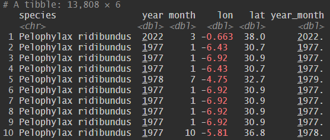
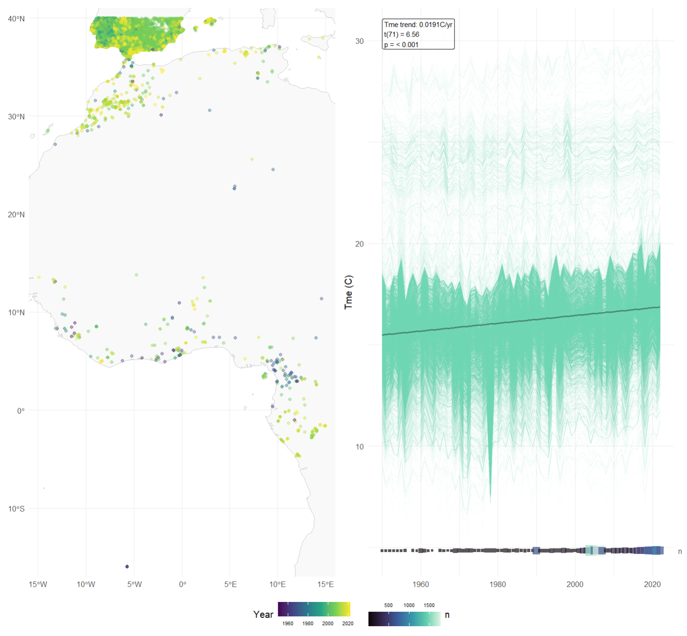
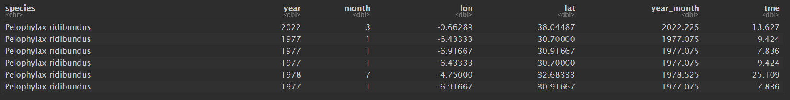
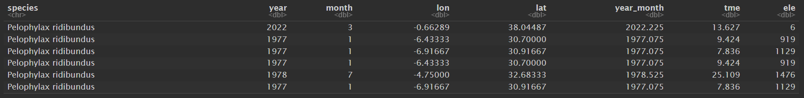
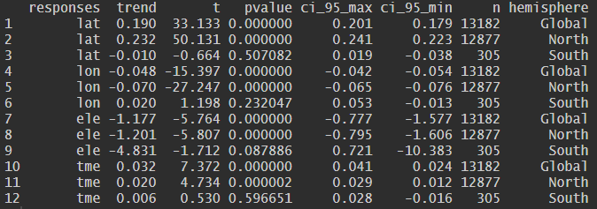
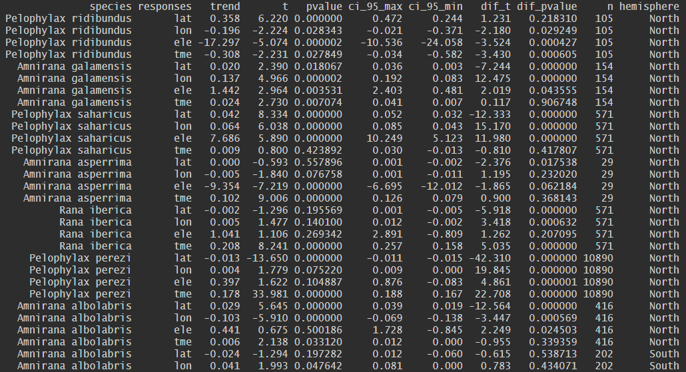
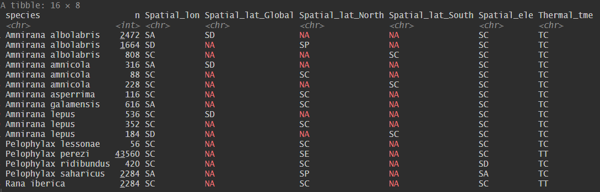

# SppTrend: Analyzing linear trends in species occurrence data

[](https://cran.r-project.org/package=SppTrend)

<div align="center">
  
</div>

The R package `SppTrend` provides a methodological framework to analyse temporal changes in species occurrence patterns in relation to spatial variables (longitude, latitude, and elevation) and temperature.
It is designed to support the development of explanatory hypotheses on the effects of environmental change on species assemblages by analysing opportunistically collected occurrence data that include temporal and geographic information.

## Installation

You can install the released version of SppTrend from CRAN:

```{r}
install.packages("SppTrend")
```

Alternatively, you can install the development version from GitHub:

```{r}
install.packages("devtools")
library(devtools)
devtools::install_github("MarioMingarro/SppTrend")
library(SppTrend)
```

## Overview of key features

`SppTrend` helps to characterise species responses to environmental change by analysing historical occurrence data that include:

  - **Predictors** - Sampling date (year, preferably month and year)

  - **Responses** - Geographic coordinates (latitude and longitude) and environmental variables (elevation and temperature).

The methodology assumes that observed species occurrences represent a temporal sequence of spatial and thermal responses to environmental change.

## Workflow

`SppTrend` provides a structured workflow for analyzing these trends:

1.  **Exploratory Diagnostic**: Quickly visualize the spatial distribution of occurrences and temporal temperature trends within the area of presence using `get_fast_info()`, based on NetCDF environmental data.

2.  **Environmental Data Integration (Optional)**:  Enhance the occurrence records with environmental information using functions like `get_era5_tme()` for temperature data or `get_elevation()` for elevation.

3.  **Overall Trend Estimation**: Estimate the average temporal trend of selected response variables across all species using `overall_trend()`. This trend serves as a  baseline against which individual species' trends are compared.

4.  **Individual Trend Analysis**: Estimate specific-specific temporal trends for each response variable using `spp_trend()`, enabling direct comparison between individual species responses and the overall trend.

5.  **Ecological Strategy Classification**: Classify species into distinct spatial or thermal response categories based on the direction and statistical significance of their species-specific trends relative to the overall trend using `spp_strategy()`.

### Data requirements and real data example

To utilize the package effectively, the input dataset must include the following information for each record:

* Species identification (e.g., `species`).
* Geographic coordinates: Latitude (`lat`) and Longitude (`lon`). **Note: Coordinates must be in the EPSG:4326 (WGS84) geographic coordinate reference system, which is the standard for biodiversity occurrence data.**
* Temporal information: Year of observation (`year`) is required. Including month (`month`) is strongly recommended to allow more detailed temporal analyses.

**Important** 

**Ensure that the column names in your input dataset match the default names expected by the `SppTrend` functions. These default names are:**

- **Species Name**: `species`
- **Year**: `year`
- **Month**: `month`
- **Longitude**: `lon`
- **Latitude**: `lat`
- **Environmental Response Variables** (if applicable): 
  - **Elevation**: `ele`
  - **Temperature**: `tme`


The following is an example using ranidae example from GBIF and selected in the exted (lon:  -10 >= record <= 10 & lat: -40 >= record <= 40) and in dates (year >= 1950).
A total of 13,808 records with 15 different species.

```{r}
ranidae <- readr::read_csv2(system.file("extdata", "example_ranidae.csv", package = "SppTrend"), 
                    col_types = cols(year = col_double(),
                                     month = col_double(),
                                     lon = col_double(),
                                     lat = col_double()))
```

Generate a continuous temporal predictor combining year and month to use a detailed predictor KKKKKK

```{r}
ranidae$year_month <- ranidae$year + (ranidae$month * 0.075)

print(head(ranidae))
```
<div align="left">
  
</div>

### Detailed steps

### Phase 1: Fast diagnostic and visual summary

The `get_fast_info()` function provides a quick visual diagnostic of the input data. 
It generates a map showing the spatial distribution of occurrence records together with a time-series plot derived from a NetCDF environmental dataste, including a linear trend analysis (slope and associated p-value). 
Using the geographic coordinates of the occurrence records, the function extracts the complete climate time-series (from the earliest to the latest year represented in the data) for the corresponding grid cells. 
All temperature values from occupied cells are then aggregated to estimate and visualise the overall environmental trend across the sampled area (including slope and associated p-value). 
This diagnostic step allows users to quickly asses the climate trajectory of the regions where the species have been recorded and to evaluate whether sufficient temporal and environmental variation is present for subsequent analyses.

*Technical notes:*

*- See `get_era5_tme()`*

```{r}
nc_file <- "path/to/your/era5_data.nc"
info <- get_fast_info(ranidae, nc_file)
```
<div align="center">
  
</div>

### Phase 2: Environmental data generation

The `SppTrend` package provides functions to enhance species occurrence records with relevant environmental information. 
At present, it supports the integration of monthly temperature data and elevation data associated with each occurrence.

#### 2.1 ERA5 temperature data

ERA5 is the fifth-generation reanalysis dataset produced by the European Centre for Medium-Range Weather Forecasts (ECMWF), providing a globally consistent representation of atmospheric, land, and ocean conditions. 
If offers high spatial and temporal resolution climate data from 1940 to the present, making it a valuable and widely used resource for assessing the influence of climate on species distributions.
Explore the **ERA5-Land monthly averaged data from 1950 to present** dataset on the Copernicus Climate Change Service (C3S) Climate Data Store (CDS) at: [ERA5 Land monthly](https://cds.climate.copernicus.eu/datasets/reanalysis-era5-land-monthly-means). 
For detailed information about the ERA5 dataset, please visit the [ECMWF website](https://confluence.ecmwf.int/display/CKB/The+family+of+ERA5+datasets).

The `SppTrend` package provides the function `get_era5_tme()` to incorporate ERA5-Land monthly climate data. 
This function retrieves mean monthly air temperature values associated with species occurrence records based on their geographic coordinates (latitude and longitude) and sampling date (year and month). 

*Technical notes:*

*- Temporal coverage: ERA5 data is available from 1950 to the present.*

*- Source: Download data from [ERA5 Land monthly](https://cds.climate.copernicus.eu/datasets/reanalysis-era5-land-monthly-means).*

*- Format: Files must be in .nc (NetCDF) format.*

```{r}
nc_file <- "path/to/your/era5_data.nc"
ranidae <- get_era5_tme(ranidae, nc_file)
print(head(ranidae)
```

<div align="left">
  
</div>

#### 2.2 Digital Elevation Model (DEM) data

The `get_elevation()` function retrieves Digital Elevation Model (DEM) values associated with species occurrence records, providing information ont the elevation at which each species was observed.
For obtaining elevation data for species occurrences, this example utilizes the WorldClim dataset ([WorldClim](https://www.worldclim.org/data/worldclim21.html)). 
However, users are encouraged to select alternative DEM sources depending on the spatial resolution and geographic scope required for their analysis. 
For instance, the [EU-DEM dataset](https://dataspace.copernicus.eu/explore-data/data-collections/copernicus-contributing-missions/collections-description/COP-DEM) offers high-resolution elevation data for Europe.

*Technical notes:*

*- Format: DEM data must be in `.tif` format.*

```{r}
dem_file <- "path/to/your/dem.tif"
ranidae <- get_elevation(ranidae, dem_file)
print(head(ranidae)
```
<div align="left">
  
</div>

Se 13,182 datos que concuerdan con la extension espacial de ERA5 kkkkk

### Phase 3: Estimation of overall response trends

The `overall_trend()` function calculates the overall temporal trend (OT) of selected response variables across the entire dataset. 
This trend integrates both environmental change and the cumulative effects of sampling bias, and serves as a neutral reference against which species-specific temporal trends are evaluated.

```{r}
predictor <- "year"
responses <- c("lat", "lon", "ele", "tme")
overall_trend_result <- overall_trend(data, predictor, responses)
print(head(overall_trend_result))
```
<div align="left">
  
</div>

### Phase 4: Estimation of species-specific response trends

The `spp_trend()` function estimates the species-specific temporal trends for each selected response variable and statistically compares them with the overall temporal trend derived from the complete dataset. 
The function also manages longitude transformations and accounts for hemisphere-specific trends to ensure consistent estimation across geographic domains.

```{r}
predictor <- "year"
responses <- c("lat", "lon", "ele", "tme")
spp <- unique(data$species)
spp_trend_result <- spp_trend(data, spp, predictor, responses, n_min = 50)
print(head(spp_trend_result))
```
<div align="left">
  
</div>

### Phase 5: Analysis of specific species responses

The `spp_strategy()` function analyses the outputs of `spp_trend()` to classify species into distinct spatial or thermal response categories based on the direction and statistical significance of their species-specific trends relative to the overall trend. 
The function incorporates hemisphere-specific logic to correctly interpret poleward shifts in latitude and can also be applied to classify elevational trends.

BONFERRONI

```{r}
spp_strategy_result <- spp_strategy(spp_trend_result, sig_level = 0.05, responses = c("lat", "lon", "ele", "tme"))
```
<div align="left">
  
</div>

## Ecological strategies

The `SppTrend` package identifies several Spatial and Thermal response strategies based on species-specific temporal trends relative to the overall background trend:

<div align="center">
  
</div>

**Spatial Responses**

  - **Spatial Adaptation (SA)**: A significant positive temporal trend in the spatial position of species occurrences. 
  In the context of climate change, this pattern is commonly associated with a poleward shift, corresponding to a northward displacement (towards higher latitude values) in the Northern Hemisphere and southward displacement (towards lower latitude values) in the Southern Hemisphere, as species expand into newly suitable areas.
 
  - **Spatial Discordance (SD)**: A significant negative temporal trend in the spatial position of species occurrences. 
  In the context of climate change, this pattern is often associated with an equatorward shift and may arise when other ecological and anthropogenic factors influence species distributions independently of, or in opposition to, climate-driven range shifts. 

  - **Spatial Conformity (SC)**: A spatial response pattern in which the species-specific temporal trend does not differ significantly from the overall trend. 
  Species showing spatial conformance share the same bias structure as the complete dataset, preventing the inference of a distinct, species-specific response to climate change at the scale of analysis.

**Thermal Responses**

  - **Thermal Tolerance (TT)**: A thermal response pattern characterised by a significant positive temporal trend in the temperature conditions under which species are observed, relative to the overall trend. 
  This pattern suggest an increased likelihood of occurrence under warmer conditions and an apparent capacity to tolerate rising temperatures through physiological, behavioural, and evolutionary mechanisms.
  
- **Thermal Adjustment (TA)**: A thermal response characterised by a significant negative temporal trend in the temperature conditions associated with species occurrences, relative to the overall trend. 
  This indicates and increasing association with cooler temperature conditions over time, potentially reflecting microevolutionary change or phenotypic adjustment.
  
  - **Thermal Conformity (TC)**: A thermal response pattern in which species-specific temperature trends do not differ significantly from the overall trend. 
  Species showing thermal conformance share the same background thermal signal as the complete dataset, preventing the formulation of specific hypotheses regarding climate-driven thermal responses.

In essence, while SA and SD describe the 'what' (change in presence) and SP/SE a potential 'how' (direction of geographic shift along the latitudinal gradient), 
these spatial responses should be considered together with the thermal responses (TT, TA) to understand if both point towards a consistent overall direction of a species' 
response to environmental change.

### Applications and limitations

`SppTrend` provides a useful methodological framework for investigating how environmental change affects biodiversity through the analysis of temporal trends in species occurrence data. 
However, results should be interpreted with caution, as opportunistic occurrence data are inherently subject to multiple sources of bias, including uneven sampling effort and variation in observer expertise. 
Although the overall trend offers a valuable community-level reference, it represents an average signal across all species and may obscure contrasting species-specific responses to drivers such as climate warming. 
Consequently, emphasis should be placed on species –level trends and their classification into ecological response strategies, which together provide a more nuanced and informative understanding of biodiversity responses to environmental change.

For more detailed information and examples, please refer to the package documentation within R:

```{r}
help(package = SppTrend)
```

### Example with real data

Detailed examples and case studies are available in the PDF guide included with the package (`inst/extdata/`).

```{r}
SppTrend_example()
```

The data used in the example are also available in: 

`inst/extdata/example_ranidae.csv`

```{r}
path <- system.file("extdata", "example_ranidae.csv", package = "SppTrend")
ranidae <- read_csv(path)
```

## References

This package is based on the methodology described in:

Lobo, JM, Mingarro, M, Godefroid, M & García-Roselló, E 2023. Taking advantage of opportunistically collected historical occurrence data to detect responses to climate change: The case of temperature and Iberian dung beetles. *Ecology and evolution*, 13(12) e10674. https://doi.org/10.1002/ece3.10674 

## Contact

For any questions or issues, please feel free to contact:

Mario Mingarro
mario_mingarro@mncn.csic.es

Jorge M. Lobo 
jorge.lobo@mncn.csic.es

Emilio García-Roselló 
egrosello@esei.uvigo.es
