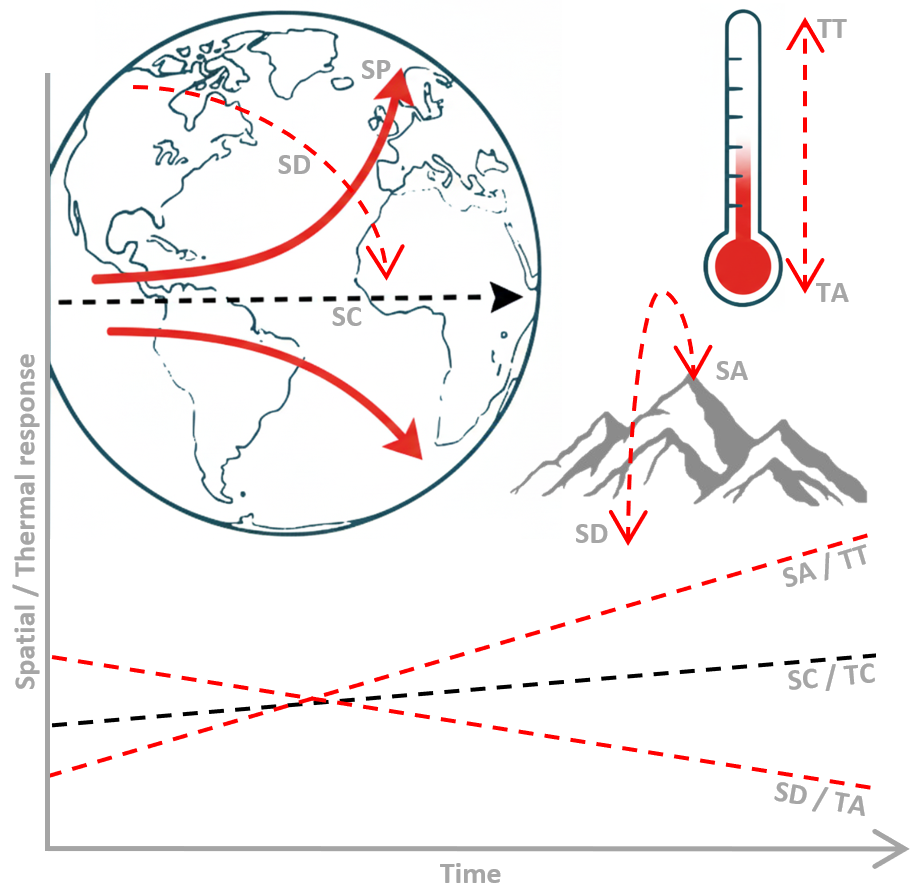
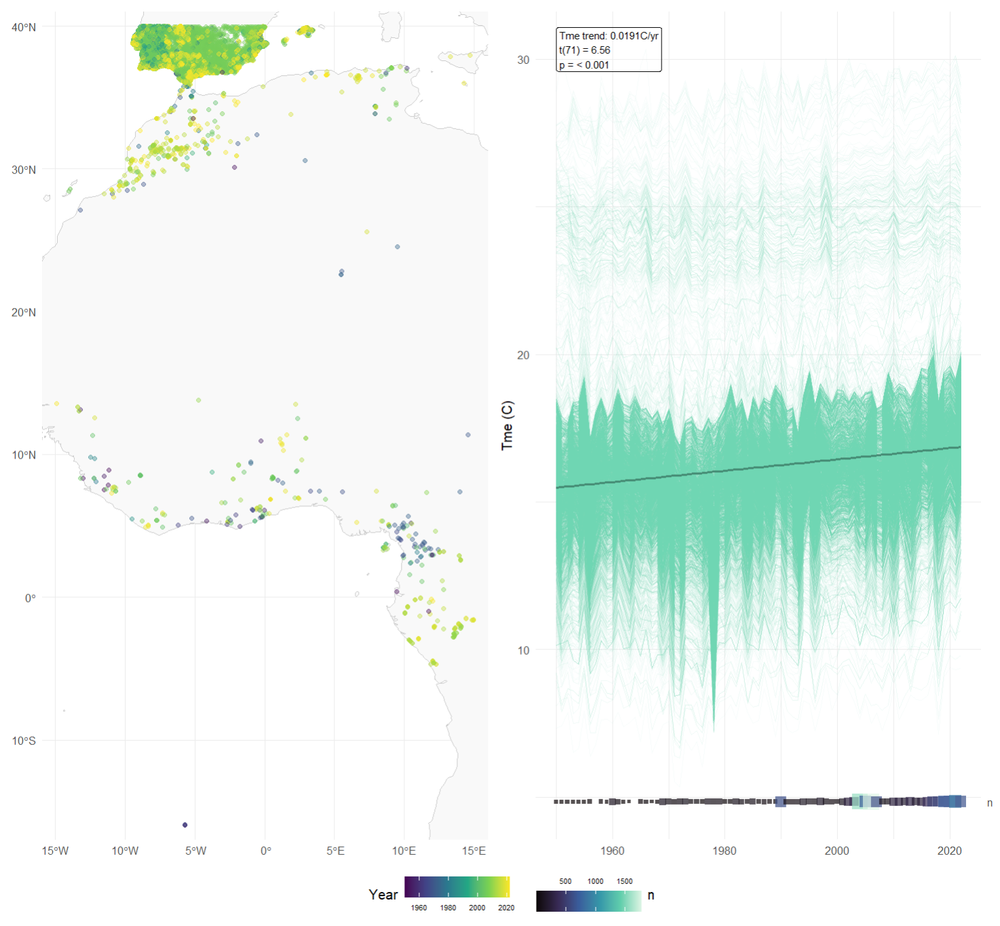
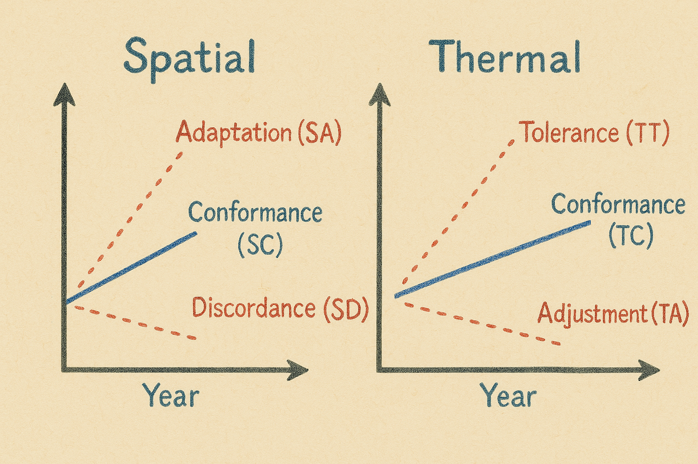

# SppTrend: Analyzing linear trends in species occurrence data

[](https://cran.r-project.org/package=SppTrend)
[](https://opensource.org/licenses/MIT)

<div align="center">

</div>

* [Installation](#installation)
* [Overview](#overview)
* [Workflow](#workflow)
* [Pre-requisites checklist](#pre-requisites-checklist)
* [Phase 1: Fast diagnostic](#phase-1-fast-diagnostic)
* [Phase 2: Environmental data](#phase-2-environmental-data-integration)
* [Phase 3: Spatial trends](#phase-3-spatial-trend-analysis)
* [Phase 4: Environmental trends](#phase-4-environmental-trend-analysis)
* [Ecological response categories](#ecological-response-categories)
* [References](#references)
* [Contact](#contact)

The R package `SppTrend` provides a comparative framework to detect species-specific spatial and thermal responses to climate change using opportunistic occurrence data.
Species temporal trends in geographic position and environmental conditions are contrasted against the overall trend of the complete dataset, explicitly accounting for shared sampling biases.
The approach is validated with virtual species exhibiting predefined response patterns under controlled scenarios of sampling bias and data availability.

## Installation

You can install the released version of SppTrend from CRAN:

```r
install.packages("SppTrend")
```

Alternatively, install the development version from GitHub:

```r
install.packages("devtools")
devtools::install_github("MarioMingarro/SppTrend")
library(SppTrend)
```

## Overview

`SppTrend` evaluates species responses to environmental change along two complementary dimensions:

- **Spatial**: Temporal shifts in geographic position (latitude and longitude), analysed jointly via Earth-Centred Earth-Fixed (ECEF) Cartesian vector analysis on the WGS84 ellipsoid (`spp_trend_spatial`).
- **Environmental**: Temporal changes in temperature and elevation conditions associated with occurrences (`spp_trend_environmental`).

The key assumption is that dominant temporal sampling biases are shared across species within a taxonomic group.
The overall trend estimated from the complete dataset therefore serves as a proxy for the combined effects of real environmental change and sampling artefacts.
Species-specific deviations from this overall trend are interpreted as evidence of differential biological responses.

### Data requirements

Input occurrence records must include:

| Column | Type | Description |
|--------|------|-------------|
| `Species` | character | Taxon name |
| `Year` | numeric | Four-digit calendar year |
| `Month` | numeric | Calendar month (1–12) |
| `Latitude` | numeric | Decimal degrees (−90 to +90) |
| `Longitude` | numeric | Decimal degrees (−180 to +180) |
| `Temperature` | numeric | Temperature at occurrence (°C) — required by `spp_trend_environmental` |
| `Elevation` | numeric | Elevation (m a.s.l.) — required by `spp_trend_environmental` |

> **Note**: Column names are case-sensitive. `spp_trend_spatial` and `spp_trend_environmental` require capitalised column names as shown above.

Temperature and elevation values can be attached to occurrence records using `get_era5_tme()` and `get_elevation()`.

### Pre-requisites checklist

- [ ] Occurrence data with `Species`, `Year`, `Month`, `Latitude`, `Longitude`.
- [ ] Coordinates in **WGS84 (EPSG:4326)**.
- [ ] Temperature values per record (optional, for environmental analysis): `.nc` ERA5 file — see `get_era5_tme()`.
- [ ] Elevation values per record (optional): `.tif` DEM file — see `get_elevation()`.

## Workflow

### Phase 1: Fast diagnostic

`get_fast_info()` generates a quick composite visualisation: a map of occurrence records coloured by year and a temperature trend time-series derived from ERA5-Land NetCDF data.

> Input data for `get_fast_info()` uses lowercase column names (`lon`, `lat`, `year`, `month`).

```r
path <- system.file("extdata", "example_ranidae.csv", package = "SppTrend")
data <- read.csv2(path)
nc_file <- "path/to/your/era5_data.nc"
info <- get_fast_info(data, nc_file)
```
<div align="center">

</div>

### Phase 2: Environmental data integration

Attach ERA5 monthly temperature and elevation values to each occurrence record before running the main analyses.

```r
nc_file<- "path/to/your/era5_data.nc"
dem_file <- "path/to/your/dem.tif"

data <- get_era5_tme(data, nc_file)
data <- get_elevation(data, dem_file)
```

Rename the resulting `tme` and `ele` columns to `Temperature` and `Elevation` (capitalised) before passing to `spp_trend_environmental()`.

### Phase 3: Spatial trend analysis

`spp_trend_spatial()` analyses temporal changes in species geographic position using ECEF (Earth-Centered, Earth-Fixed) vector analysis.
It estimates temporal slopes in 3D space, projects them onto the local tangent plane, and classifies each species against a global reference vector.

```r
colnames(data) <- c("Species", "Year", "Month", "Latitude", "Longitude", "Temperature", "Elevation")

result_spatial <- spp_trend_spatial(
data= data,
min_records = 20,
min_years = 5,
spatial_simulation_n= 1000,
spatial_probability_threshold = 0.90,
direction_angle_threshold_deg = 68,
random_seed = 42
)

# Main results table (includes global pool row)
head(result_spatial$spatial)

# Species filtering summary
result_spatial$species_filter

# Analysis metadata and thresholds used
result_spatial$metadata
```

#### Spatial results columns (key)

| Column | Description |
|--------|-------------|
| `speed_surface_km_year` | Surface displacement speed (km yr⁻¹) projected onto the local tangent plane |
| `direction_bearing_deg` | Absolute bearing (0–360°, clockwise from North) |
| `direction_cardinal` | Eight-point compass direction (N, NE, E, …) |
| `angle_to_global_3d_deg` | 3D angle between species and global ECEF slope vectors |
| `prob_speed_greater_than_global` | Monte Carlo probability that species speed > global speed |
| `prob_direction_different_from_global` | Monte Carlo probability that direction differs from global |
| `spatial_class_Latitudelon` | **SA**, **SD**, or **SC** |

### Phase 4: Environmental trend analysis

`spp_trend_environmental()` fits independent OLS regressions for temperature and/or elevation per species, compares them against the global slope via Welch–Satterthwaite t-tests, applies Benjamini–Hochberg FDR correction, and optionally penalises statistical significance for large sample sizes.

```r
result_env <- spp_trend_environmental(
data = occ_data,
responses= c("Temperature", "Elevation"),
min_records= 20,
min_years= 5,
alpha_ref= 0.05,
use_Ncorrected_alpha = TRUE,
individual_lm_min_thresholds = c(Temperature = 0.01, Elevation = 50),
individual_lm_threshold_type = "speciesslope"
)

# Classification table
head(result_env$environmental_comparison)

# Global community trends
result_env$environmental_global_lm

# Species filtering summary
result_env$species_filter[result_env$species_filter$retained, ]
```

#### Key parameters

| Parameter | Default | Description |
|-----------|---------|-------------|
| `alpha_ref` | `0.05` | Baseline significance level |
| `use_Ncorrected_alpha` | `TRUE` | Penalise significance for species with N > 100 records: α_eff = α_ref × √(100/N) |
| `individual_lm_min_thresholds` | `c(Temperature=0.01, Elevation=50)` | Minimum ecological effect size (°C yr⁻¹ or m yr⁻¹) required for non-conformance classification |
| `individual_lm_threshold_type` | `"speciesslope"` | Apply threshold to absolute species slope (`"speciesslope"`) or deviation from global slope (`"slopediff"`) |

## Ecological response categories

<div align="center">

</div>

### Spatial responses (`spp_trend_spatial`)

| Class | Name | Description |
|-------|------|-------------|
| **SA** | Spatial Adaptation | Species moves faster than the global pool, or in a significantly different direction that is poleward. Consistent with climate-driven range shift. |
| **SD** | Spatial Discordance | Species moves slower than the global pool, or in a significantly different non-poleward direction. Inconsistent with strict climate control. |
| **SC** | Spatial Conformance | Neither speed nor direction differs significantly from the global pattern. Response indistinguishable from overall sampling signal. |

### Environmental responses (`spp_trend_environmental`)

| Class | Name | Variable | Description |
|-------|------|----------|-------------|
| **TT** | Thermal Tolerance | Temperature | Significant positive temporal slope. Species increasingly associated with warmer conditions. |
| **TA** | Thermal Adjustment | Temperature | Significant negative temporal slope. Species shifting towards cooler conditions. |
| **TC** | Thermal Conformance | Temperature | Trend not significantly different from overall trend. |
| **SA** | Spatial Adaptation | Elevation | Significant positive elevation trend (upslope shift). |
| **SD** | Spatial Discordance | Elevation | Significant negative elevation trend (downslope shift). |
| **SC** | Spatial Conformance | Elevation | Elevation trend not significantly different from overall trend. |

A non-conformance class (TT, TA, SA, SD) is assigned only when: (i) the individual species slope is statistically significant after FDR correction, (ii) the deviation from the global slope is also significant, and (iii) the magnitude of the effect exceeds the minimum ecological threshold.

### Interpreting results together

Spatial and environmental responses are independent dimensions — a species can exhibit any combination.
Comparing both helps identify internally consistent signals: for example, a species showing SA (poleward shift) together with TT (increasing temperature association) may indicate passive tracking of warming conditions, whereas SA with TA might reflect active colonisation of cooler high-latitude environments.

## Applications and limitations

This framework does not aim to establish causal attribution, but rather to identify robust deviations from background trends consistent with climate-driven responses.
The approach is deliberately conservative: requiring species-specific trends to differ significantly from the overall trend minimises false positives while potentially yielding false negatives.
Results should be interpreted with caution given the inherent biases in opportunistic occurrence data.
Spatial conformance (SC) species are especially sensitive to sampling bias because their classification depends on the accuracy of the overall reference trend.

## Example data

The package includes an example dataset (`example_ranidae.csv`) with 13,808 records of 15 Ranidae species:

```r
path <- system.file("extdata", "example_ranidae.csv", package = "SppTrend")
ranidae <- read.csv(path)
```

## References

Lobo, J.M., Mingarro, M., Godefroid, M., García-Roselló, E., 2023. Taking advantage of opportunistically collected historical occurrence data to detect responses to climate change: The case of temperature and Iberian dung beetles. *Ecology and Evolution*, 13, e10674. https://doi.org/10.1002/ece3.10674

Mingarro, M., García-Roselló, E., Lobo, J.M., 2026. Assessing the ability of opportunistic occurrence data to detect species responses to climate change (in press).

## Contact

Mario Mingarro — mario_mingarro@mncn.csic.es

Jorge M. Lobo — jorge.lobo@mncn.csic.es

Emilio García-Roselló — egrosello@esei.uvigo.es
